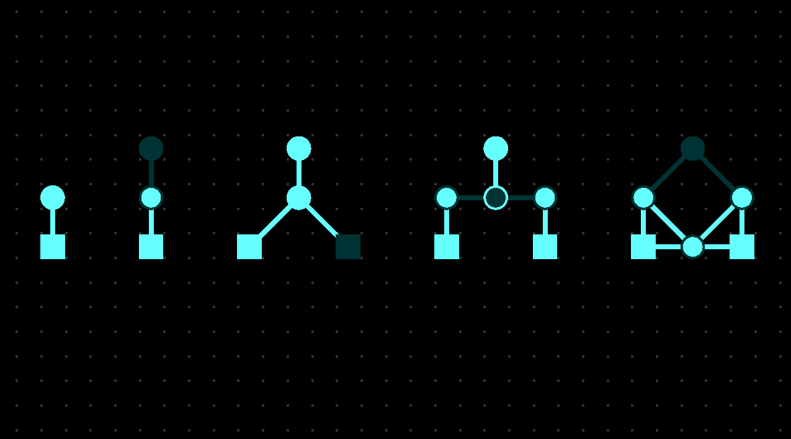

# Circuit simulation
This simple demo simulates current flowing through nodes, as if on a circuitboard. Provided in the model viewer are the setups for the basic gates: NOT, OR, AND, and XOR.

### Controls:

- Mouse click and drag will move the camera, and the scrollwheel will zoom in and out.
- Pressing F while hovering on an input node will flip it's state to on or off.
- Pressing F while hovering on a regular node will switch it's mode to forward or toggle.
- Pressing the spacebar will pause or unpause the simulation. On load, the simulation is paused.

### How it works:

The model is constructed using nodes, of which there are two types: input, and regular. Input nodes feed current into the system based on user input, while regular nodes feed current into their outputs based on their inputs.

Regular nodes have two modes, which can be toggled with the F key. The default mode is "forward", which will forward current, if it recieves any, to all of it's outputs. "Toggle" functions the same, except it forwards the opposite of what it's receiving to it's outputs - if it recieves no current, it forwards current to it's outputs, and vice versa.

### About:

This project was an exercise for a class I took in the fall of 2023. I may expand on it in the future, however I would not consider this project to be in active development.